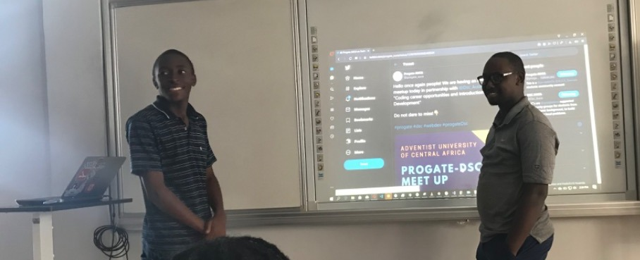

<!--
**salviosage/salviosage** is a ✨ _special_ ✨ repository because its `README.md` (this file) appears on your GitHub profile.
### Hi there 👋
Here are some ideas to get you started:

- 🔭 I’m currently working on ...
- 🌱 I’m currently learning ...
- 👯 I’m looking to collaborate on ...
- 🤔 I’m looking for help with ...
- 💬 Ask me about ...
- 📫 How to reach me: ...
- 😄 Pronouns: ...
- ⚡ Fun fact: ...
-->

# 
 Hi there 👋 , I am Jean (Jeans👖 if you're Anglophone 😄) 

<!-- 
---

--- -->

**ABOUT ME...**

<h4>Just a normal folk who write codes. Pursuing being 👉👈 </h4>
<!-- 
 Checkout my linkedin - **[MY LINKEDIN](https://www.linkedin.com/in/jean-salvi/)**  -->

- 👯 Got a podcast or event, looking for a speaker? well 👇 

- 💬 Let's chat about Automation (AI,ML) 
-  👩‍💻 Currently learning: Deep Reinforcement Learning  **[(be my companion)](https://github.com/salviosage/Deep_R_Learning)** 
- ⚡ Fun fact: fun_fact_can_not_be_empty  😜

**TECHNOLOGIES I WORK WITH**

<!--  🌐 **REACH ME ON**

- 
- 
- 

 -->

<!-- 
**GITHUB STAT'S**

 -->

### Connect with me:

      
___

|My github statistics|My languages|Streaks|
|-|-|-|
|||

